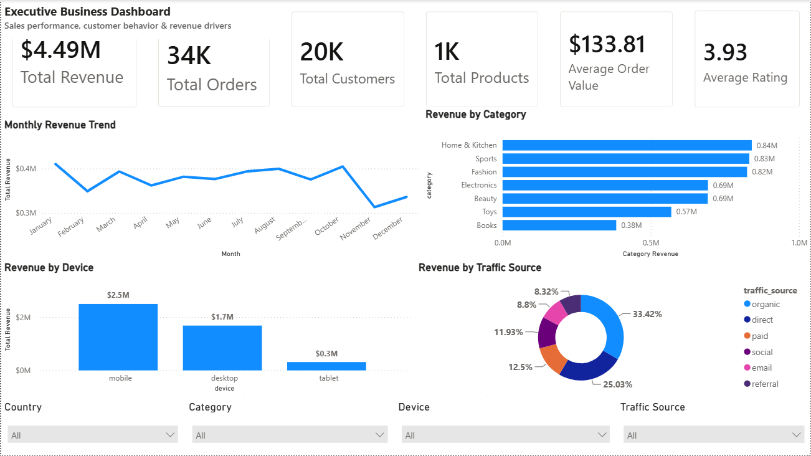
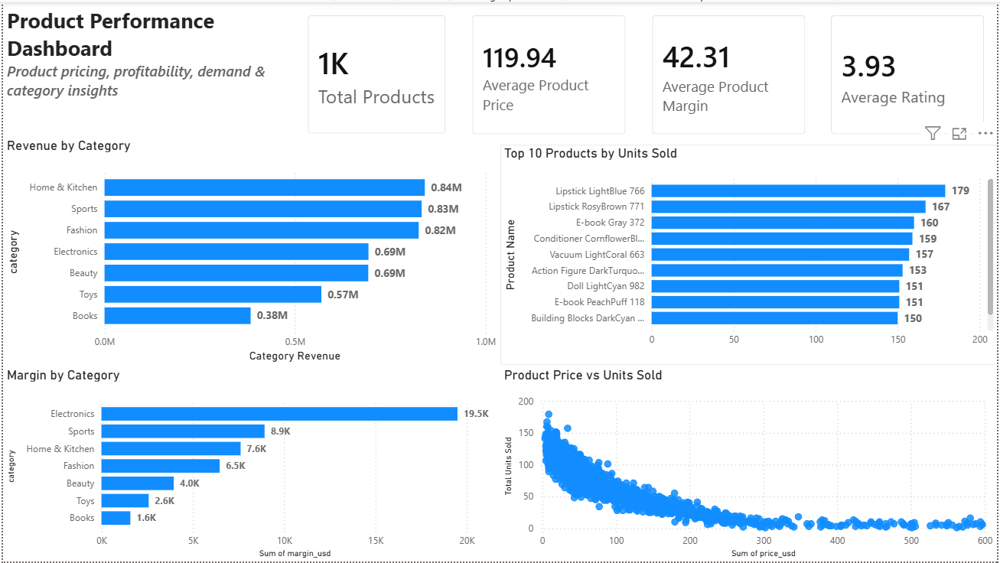
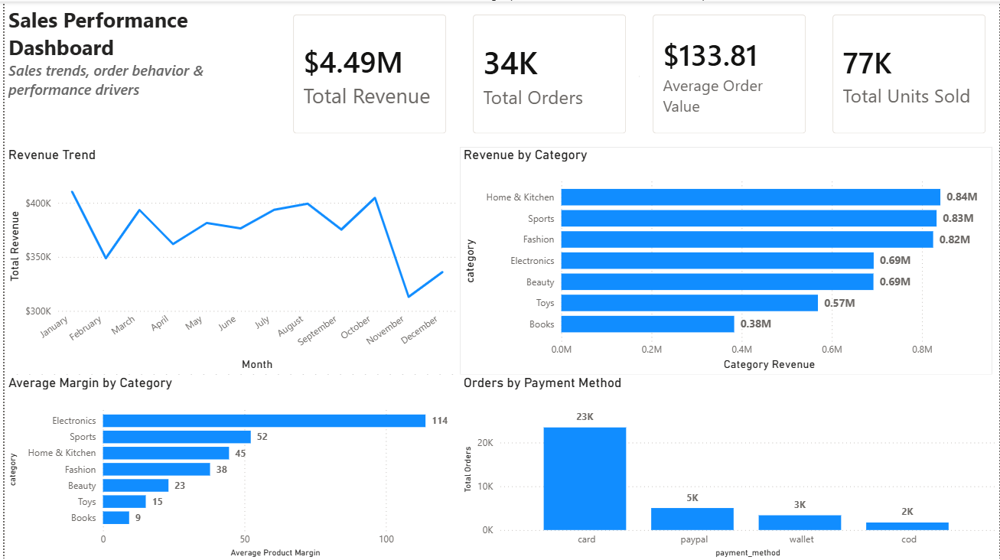
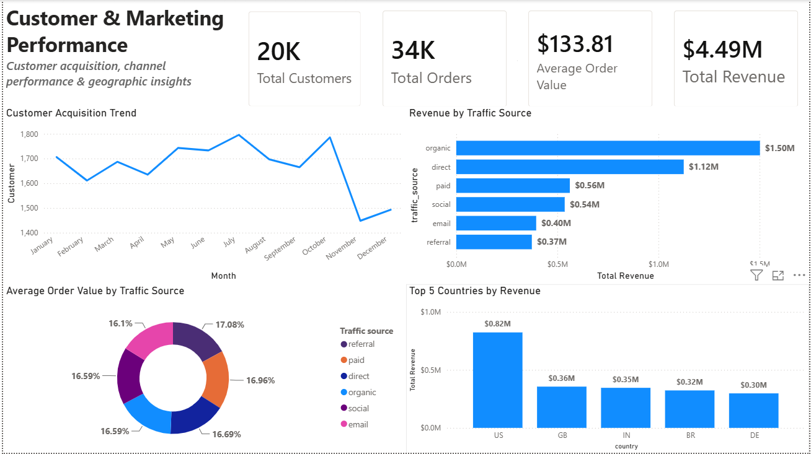

# Retail Sales Analytics

## Project Overview

An end-to-end retail sales analytics project built to demonstrate practical **SQL, data analysis, business intelligence, and marketing analytics** skills.

The project analyzes retail transaction data to identify drivers of sales performance, product profitability, customer behavior, marketing effectiveness, and geographic performance.

## Power BI Dashboard Preview

### Executive Sales Overview



### Product Analysis



### Sales Performance



### Customer & Marketing Analysis



## Business Objectives

- Evaluate overall sales and profitability performance
- Identify high-performing and underperforming products
- Analyze customer purchasing behavior and value
- Measure marketing channel performance
- Compare geographic sales performance
- Build reusable SQL views for business reporting
- Translate analytical findings into actionable Power BI dashboards

## Tools & Technologies

- **SQL** — Data preparation, validation, transformation, analysis, joins, CTEs, window functions, views
- **Microsoft Power BI** — Data modeling, DAX, KPI development, interactive dashboards
- **Excel / CSV** — Source data and supporting analysis
- **GitHub** — Project documentation and version control

## Project Structure


```text
Retail-sales-analytics/
│
├── Data/
│   └── README.md
│
├── PowerBI/
│   ├── Dashboard_Screenshots/
│   ├── SQL/
│   └── README.md
│
└── README.md
## Data & Dataset

The project uses retail transaction data containing order-level information across customers, products, sales, profit, geography, and marketing-related attributes.

The dataset was prepared and validated before analysis to ensure consistency across analytical outputs.

> Raw source data is not included in the repository.

---

## SQL Analysis

SQL was used as the primary analytical layer for data preparation, validation, transformation, and business analysis.

### Analysis Areas

- Data validation and cleaning
- Sales and profitability analysis
- Customer behavior analysis
- Product performance analysis
- Marketing channel analysis
- Geographic performance analysis
- Executive KPI analysis
- Business-focused aggregations
- Reusable SQL views

### SQL Techniques Demonstrated

- `SELECT`, `WHERE`, `GROUP BY`, `HAVING`
- `JOIN` operations
- Common Table Expressions (CTEs)
- Subqueries
- Aggregate functions
- `CASE` expressions
- Window functions
- Date-based analysis
- Data validation and quality checks
- SQL views
- Primary and foreign key relationships

The SQL scripts are organized in the `PowerBI/SQL/` directory.

---

## Power BI Dashboard

The Power BI layer converts the SQL analysis into interactive business dashboards designed for decision-making.

### Dashboard Pages

#### Executive Sales Overview

Provides a high-level view of:

- Total Sales
- Total Profit
- Profit Margin
- Orders
- Sales trends
- Overall business performance

#### Product Analysis

Focuses on:

- Product and category performance
- Sales contribution
- Profitability
- Top and underperforming products
- Product-level trends

#### Sales Performance

Analyzes:

- Sales trends
- Regional performance
- Geographic contribution
- Performance comparisons
- Key sales drivers

#### Customer & Marketing Analysis

Examines:

- Customer purchasing behavior
- Customer value
- Marketing channel performance
- Customer and channel contribution
- Marketing effectiveness

---

## Key Business Questions

The project was designed to answer practical business questions such as:

1. Which products and categories generate the highest sales and profit?
2. Which products have strong sales but weak profitability?
3. Which customer segments contribute the most value?
4. Which marketing channels perform most effectively?
5. Which geographic regions drive sales and profit?
6. How does sales performance change over time?
7. Where are the major opportunities for improving profitability?
8. Which areas require management attention?

---

## Key Business Insights

The analysis translates raw retail transactions into actionable insights across:

- Sales growth and performance
- Product profitability
- Customer value
- Marketing effectiveness
- Geographic performance
- Revenue and profit drivers

The final Power BI dashboards provide an executive-level view while allowing users to drill down into product, customer, marketing, and geographic performance.

---

## Business Recommendations

Based on the SQL analysis and Power BI dashboards, the following business recommendations were identified:

### 1. Prioritize High-Performing Product Categories

Home & Kitchen generated the highest category revenue in the analysis.

**Recommendation:**  
Prioritize inventory availability, merchandising, and promotional visibility for high-performing categories. However, revenue should be evaluated alongside product margin before increasing promotional spend.

**Evidence:**  
Category revenue and profitability were analyzed using SQL and visualized in the Product Analysis section of the Power BI dashboard.

---

### 2. Strengthen Organic Acquisition

Organic traffic was the strongest revenue-generating traffic source.

**Recommendation:**  
Continue investing in organic acquisition through SEO, content, and product discoverability while monitoring revenue and average order value to ensure the channel continues to generate high-value customers.

**Evidence:**  
SQL analysis compares revenue, orders, sessions, and average order value across traffic sources. The Customer & Marketing Power BI dashboard provides the corresponding channel-performance view.

---

### 3. Optimize the Mobile Shopping Experience

Mobile generated the highest revenue among the analyzed devices.

**Recommendation:**  
Prioritize the mobile customer journey, particularly product discovery, page performance, checkout usability, and overall shopping experience.

**Evidence:**  
SQL compares revenue and average order value by device, while the Sales Performance and Customer & Marketing dashboards provide the visual device-level comparison.

---

### 4. Protect Product Profitability

Electronics showed the highest average product margin in the analysis.

**Recommendation:**  
Use profitability together with revenue when deciding which products and categories should receive additional inventory or promotional support. High sales volume should not be the only criterion for prioritization.

**Evidence:**  
Product-level revenue, gross profit, and margin were analyzed using SQL and presented through the Product Analysis dashboard.

---

### 5. Focus Retention Efforts on the Existing Customer Base

The analysis identified a **61.75% repeat customer rate**, indicating that a substantial portion of customers already make repeat purchases.

**Recommendation:**  
Prioritize retention initiatives such as personalized offers, relevant product recommendations, and targeted marketing campaigns to increase purchase frequency and customer lifetime value.

**Evidence:**  
SQL calculated the repeat customer rate and customer-level revenue, while the Customer & Marketing dashboard provides customer and marketing performance analysis.

---

### 6. Prioritize the Largest Revenue Market

The United States generated the highest revenue among the analyzed countries.

**Recommendation:**  
Prioritize customer retention, product availability, and targeted marketing in the strongest revenue market while using the same KPIs to identify opportunities in lower-performing markets.

**Evidence:**  
Country-level revenue, orders, and customer performance were analyzed in SQL and represented in the Power BI geographic analysis.

## Skills Demonstrated

### SQL

- Data cleaning and validation
- Data transformation
- Relational joins
- CTEs
- Window functions
- Aggregations
- Business logic using `CASE`
- SQL views
- KPI calculations
- Analytical querying

### Power BI

- Data modeling
- DAX measures
- KPI development
- Interactive dashboards
- Slicers and filters
- Drill-down analysis
- Business-focused visualizations
- Dashboard design

### Business & Marketing Analytics

- Sales performance analysis
- Profitability analysis
- Customer behavior analysis
- Product analysis
- Marketing channel analysis
- Geographic analysis
- KPI interpretation
- Converting analytical findings into business recommendations

### Data & Reporting

- Excel / CSV data handling
- Data quality checks
- Structured analytical workflows
- Version control using GitHub
- Business-oriented documentation

---

## Project Outcome

This project demonstrates an end-to-end Business Intelligence workflow:

**Raw Data → Data Validation → SQL Analysis → Business KPIs → Power BI Data Model → Interactive Dashboards → Business Insights**

The project combines technical SQL and Power BI skills with business and marketing analysis to demonstrate how data can be transformed into actionable business intelligence.
